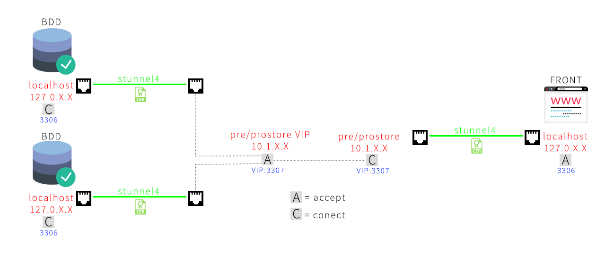

Chiffrement des communications entre les bases de données et les frontaux : stunnel4
#########################################################################################
.. sectnum::
	      
Context
========

Récemment une étude concernant le cryptage des flux entre les bases de données et les frontaux a été menée. Il s’agit de répondre à l’un des prérequis de la PSSI.

Ce système est d’ores et déjà mis en place.

(Illustration du système stunnel en place en pré-production).

Configuration
==============

Pour faire simple voici comment cela fonctionne :

Premièrement, un certificat auto-signé d’une durée de validité de 10 ans est généré sur les bases de données et les frontaux à l’aide de openssl.

Il faut savoir que chaque VM dispose au minimum de deux interfaces, une interface virtuel **lo** (localhost) et une interface de **communication** connectée au réseau (afin de pouvoir communiquer avec les autres VMs).

Ensuite, nous configurons le programme *stunnel* sur les bases de données en mode serveur (stunnel étant un programme client-serveur) avec les certificats générés.

Stunnel se charge de crée un tunnel entre l’interface virtuel lo et l’interface de communication en local sur la VM.

:stunnel: est un programme qui va permettre d’encapsuler un flux de données dans un tunnel ssl/tls de façon à chiffrer la communication entre le serveur et le client
	  https://www.stunnel.org/index.html

Voici un exemple de la configuration des bases de données ;
::
   
   [MySQL]
   accept  = xxxxxxxxx:3307
   connect = 3306

**[MySQL]** correspond au nom du service configuré.
   
**accept** correspond au trafic que la VM acceptera. Ici prevzn3bddwrite1 correspond à la VIP présente sur l’un des masters.

**connect** correspond au tunnel que la VM créera lors d’une connexion. Ici 3306 correspond au port de MySQL de la VM. (Il faut comprendre localhost :3306)

Enfin pour les frontaux, ils sont configurés de la manière suivante ;
::
   
   [MySQL]
   accept     = 3306
   connect    = xxxxxxxxxxxx:3307
   client     = yes

**[MySQL]** correspond toujours au nom du service configuré.
   
**accept** correspond toujours au trafic que la VM acceptera. Ici 3306 correspond au localhost de la machine.

**connect** correspond au tunnel que la VM créera lors de la demande de connexion.

**client** correspond au mode que la VM prendra pour ce tunnel. (Par défaut il est à no)

Ainsi configuré, un client se connectera de la manière suivante à sa base de données MySQL : ::

  mysql -h xxxxxxxxxxxxx --port 3306 -u test -p

Mise en place
===============

Afin de pouvoir utiliser cette nouvelle configuration, voici les nouveaux paramètres à appliquer dans la configuration de vos applications/projets en fonction du frontal sur lequel il/elle se trouve.

front
-------------

Pour atteindre les bases de données [prebdd] : ::
  
  resources.db.params.host     = xxxxxxxxxxxx
  resources.db.params.username = xxxxxxx
  resources.db.params.password = "xxxxxxx"
  resources.db.params.dbname   = xxxxxxx

Pour les bases de données [prev] : ::

  resources.db.params.host     = xxxxxxxxxxxx
  resources.db.params.username = xxxxxxx
  resources.db.params.password = "xxxxxxx"
  resources.db.params.dbname   = xxxxxxx
